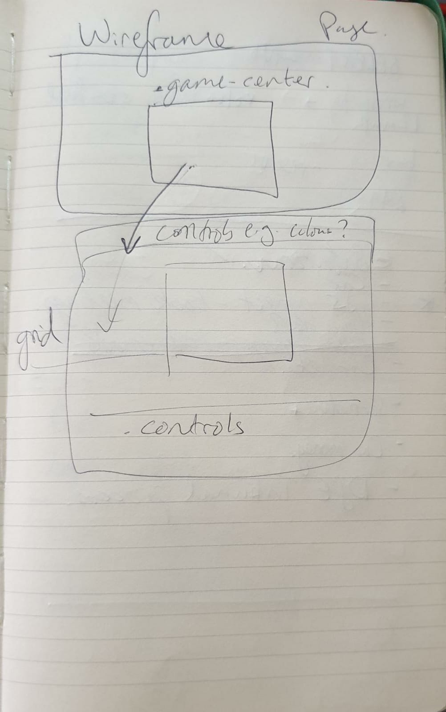

# Noughts and Crosses

This is a simple noughts and crosses game where the computer places its token randomly. Making it very easy. The next step would be to add difficulty levels where the computer selects squares to win

## Features

A noughts and crosses game. It has the option to select token, that is, whether to play as noughts or crosses. I use javascript to run the game and check for wins

## Testing and validation

### Bugs

+ I've had to define empty too many times - potential for global variable definiton but want to avoid the risks of that

+ favicon

+ Not refreshing the Game winner message on New Game - also consider saying whether winner is player or 'PC'
+ Doesn't restart game to choose token again
+ Once New Game called no longer calles PC turn
    - This was resolved by clearing the game message as the presence of the game message prevents turns

+ doesn't recognise middle vertical line as a win
    - added additional line to caseWin5 to cover this

### Solved Bugs

+ Incorrect win definitions - corrected win definitions - using brackets and corrected one reference to the wrong box. The ands needed containig in brackets as they were mixing with the ors for the different possibilities

+ relies on user to reset board - created reload function - currently only called when game reaches stalemate - will adjust to be called with button. remove for now

+ checks for winner and can call winner for blank spaces - corrected by adding clause to win checks to ensure the box is not empty and there is a win

+ clicking already filled box runs functions and adds aditional computer token - corrected by changing from checking the box is not empty to run functinos to making sure that if the box is not empty do nothing else do the rest of the functions

+ failed to call winner; seems to be that when O/computer is winner it only calls after next turn - correct by calling checkPlayerWin function again after computer turn

+ calls winner before inputting token - solved by removing alerts

+ allows cicking while form/modal is open - change CSS to 'pointer-events: none' for gridboxes then use JS to change the pointer-evetns to all on each of the grid-boxes

+ not centre aligned on media queries? and font contrast

+ says game over - stalemate when board full even if shows a winner - disappeared with other changes

### Validators

