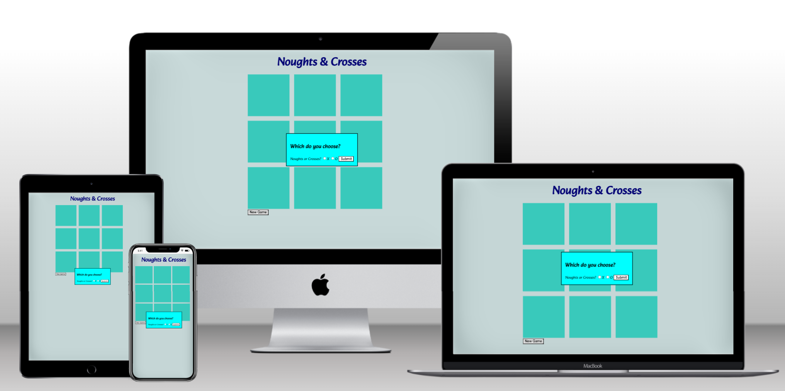

# Noughts and Crosses

This is a simple noughts and crosses game where the computer places its token randomly. This makes it very easy. A possible next step could be to add difficulty levels where the computer selects squares to win based on some logic rather than random selection

Live site: https://uhassam0.github.io/CI2-Noughts-Crosses/

## Features

A noughts and crosses game. It has the option for the user to select their token, that is, whether to play as noughts or crosses. I use javascript to run the game and check for wins

+ Ability to choose token used and start game

+ Main game play where player clicks lead to otoken input and pc auto input

+ Winner or stalemate declared and option for new game available

### Wireframes

This was a rough wireframe I drew to show how I intended the game to look

I thought through and drew the logic in a flowchart using LucidChart

## Testing and validation

There are some instances where Chrome Dev tools show a horizontal scroll on small screen sizes. However, this was difficult to replicate and did not happen on my phone which is a relatively smaller screen

### Bugs

### Solved Bugs

+ Incorrect win definitions - corrected win definitions - using brackets and corrected one reference to the wrong box. The ands needed containig in brackets as they were mixing with the ors for the different possibilities

+ relies on user to reset board - created reload function - currently only called when game reaches stalemate - will adjust to be called with button. remove for now

+ checks for winner and can call winner for blank spaces - corrected by adding clause to win checks to ensure the box is not empty and there is a win

+ clicking already filled box runs functions and adds aditional computer token - corrected by changing from checking the box is not empty to run functinos to making sure that if the box is not empty do nothing else do the rest of the functions

+ failed to call winner; seems to be that when O/computer is winner it only calls after next turn - correct by calling checkPlayerWin function again after computer turn

+ calls winner before inputting token - solved by removing alerts

+ allows cicking while form/modal is open - change CSS to 'pointer-events: none' for gridboxes then use JS to change the pointer-evetns to all on each of the grid-boxes

+ not centre aligned on media queries? and font contrast

+ says game over - stalemate when board full even if shows a winner - disappeared with other changes

+ Not refreshing the Game winner message on New Game - also consider saying whether winner is player or 'PC'
    - added to new game function

+ Doesn't restart game to choose token again
    - added showModal function to new game function

+ Once New Game called no longer calles PC turn
    - This was resolved by clearing the game message as the presence of the game message prevents turns

+ doesn't recognise middle vertical line as a win
    - added additional line to caseWin5 to cover this

### Validators

Passed code through the W3C validators for HTML and CSS and JSHint for the JavaScript, and ensured all code passed

## Cloning, Forking and Deployment

This repository can be cloned by clicking the green 'code' button at the top which gives you the code to copy to clone using the GitHub CLI in your own IDE

You can fork this repository easily by clicking the fork button at the top of the page (above and to the code button)

Deployment to GitHub Pages:

1. Navigate to the settings tab of the repository
1. Navigate to the Pages section of settings using the headings on the left
1. Ensure 'Deploy from a branch' is selected under source
1. Select the 'main' branch under branch
1. After a short while you should see the box at the top of the page indicating success and the live site address

My live site is at: https://uhassam0.github.io/CI2-Noughts-Crosses/

## Credits

Some inspiration for the CSS came from [Kevin Powell's](https://www.youtube.com/@KevinPowell) YouTube channel. In particular the use of a modal

I used general results from google for general troubleshooting and syntax reminders. Special mention to Mozilla Docs and W3School

Favicon from [Pixabay](https://pixabay.com/vectors/controller-pad-video-game-1294077/)